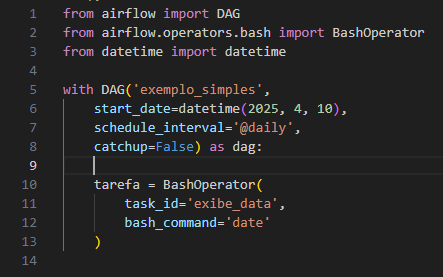

# Airflow

## 1. Introdução

**Apache Airflow** é uma plataforma de orquestração de workflows criada para programar, monitorar e gerenciar pipelines de dados de forma escalável e eficiente. Ele permite que você defina fluxos de trabalho como código (conhecido como DAGs – Directed Acyclic Graphs), facilitando a automação de processos complexos, como execução de scripts, consultas a bancos de dados, movimentação de arquivos e muito mais.

O Airflow foi desenvolvido pelo Airbnb e depois se tornou um projeto de código aberto sob a Apache Software Foundation. Seu design modular e extensível o torna ideal para integração com diversos serviços e sistemas, como bancos de dados, APIs, ferramentas de nuvem e data warehouses.Características.

## 1.1 Principais Características
- **Orquestração como código:** Use Python para definir tarefas e dependências.

- **Agendamento robusto:** Agende jobs com flexibilidade e precisão.

- **Monitoramento via interface web:** Acompanhe a execução das tarefas em tempo real.

- **Extensível:** Crie seus próprios operadores e plugins.

- **Escalável:** Integra-se com Kubernetes, Celery, Docker e outros para escalar horizontalmente.

## 1.2 Conceitos Básicos
- **DAG (Directed Acyclic Graph):** Define a estrutura do fluxo de trabalho.

- **Operadores:** Unidades de trabalho que realizam uma tarefa específica (ex: BashOperator, PythonOperator).

- **Tarefa (Task):** Instância de um operador dentro de uma DAG.

- **Scheduler:** Responsável por programar e disparar as tarefas de acordo com o agendamento.

- **Executor:** Gerencia como as tarefas são executadas (pode ser local, Celery, Kubernetes etc.).

- **Web UI:** Painel para visualização e gerenciamento dos DAGs e tarefas.

**Excemplo Simples:**

